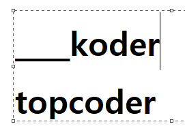

# [Silver IV] 문자열 - 1120 

[문제 링크](https://www.acmicpc.net/problem/1120) 

### 성능 요약

메모리: 2076 KB, 시간: 0 ms

### 분류

브루트포스 알고리즘, 문자열

### 제출 일자

2024년 6월 3일 22:19:12

### 문제 설명

<p>길이가 N으로 같은 문자열 X와 Y가 있을 때, 두 문자열 X와 Y의 차이는 X[i] ≠ Y[i]인 i의 개수이다. 예를 들어, X=”jimin”, Y=”minji”이면, 둘의 차이는 4이다.</p>

<p>두 문자열 A와 B가 주어진다. 이때, A의 길이는 B의 길이보다 작거나 같다. 이제 A의 길이가 B의 길이와 같아질 때 까지 다음과 같은 연산을 할 수 있다.</p>

<ol>
	<li>A의 앞에 아무 알파벳이나 추가한다.</li>
	<li>A의 뒤에 아무 알파벳이나 추가한다.</li>
</ol>

<p>이때, A와 B의 길이가 같으면서, A와 B의 차이를 최소로 하는 프로그램을 작성하시오.</p>

### 입력 

 <p>첫째 줄에 A와 B가 주어진다. A와 B의 길이는 최대 50이고, A의 길이는 B의 길이보다 작거나 같고, 알파벳 소문자로만 이루어져 있다.</p>

### 출력 

 <p>A와 B의 길이가 같으면서, A와 B의 차이를 최소가 되도록 했을 때, 그 차이를 출력하시오.</p>

## 풀이
- A는 B보다 항상 작거나 같다.
- A와 B의 길이가 같아질 때까지 연산을 한다.
	- A의 앞에 아무 알파벳이나 추가한다.
	- A의 뒤에 아무 알파벳이나 추가한다.
여기서 문제의 핵심은 정말 아무 알파벳이나 추가하는것이 아니라 앞뒤를 배제하고 비교하면 된다는 뜻이다.  

```koder topcoder```  
위와 같을때 A는 앞뒤의 3개를 배제시키고 비교한다.

위와 같이 정답이 되는 경우는 각 5글자만 비교하고 그 최솟값을 구하면 되겠다.


## 코드
```cpp
#define _CRT_SECURE_NO_WARNINGS
#include <iostream>
#include <algorithm>
#include <string>
#include <sstream>

using namespace std;
string input;
string a;
string b;

int main() {
	freopen("input.txt", "r", stdin);

	getline(cin, input);
	istringstream iss(input);

	iss >> a >> b;

	// 결과 출력
	//std::cout << "First string: " << a << std::endl;
	//std::cout << "Second string: " << b << std::endl;

	int count = 0;
	if (a.length() == b.length()) 
	{
		for (int i = 0; i < a.length(); i++)
			if (a[i] != b[i]) 
				count++;
	}
	else
	{
		int diff_num = b.length() - a.length();
		int min = 99999;
		for (int i = 0; i <= diff_num; i++)
		{
			count = 0;
			for (int j = 0; j < a.length(); j++) {
				//cout << a[j] << " " << b[i + j] << endl;
				if (a[j] != b[i+j])
					count++;
			}
			if (min > count) {
				min = count;
			}
		}
		count = min;
	}
	//answer
	cout << count;
	return 0;
}
```

## 보완할 점
한 줄에서 두 스트링을 어떻게 읽어올지 몰라 getline을 활용했는데, 더 간단한 법이 있었다.

```cin >> a >> b;```
이렇게 바로 받는것이 가능했다.

min의 초기화값을 변경하였다.  
```int ans = 0x3f3f3f3f```
기존의 99999는 여러 유형의 문제중 분명 문제를 일으킬만한 값이기에,
__INT_MAX__ 값으로 보완하려 했지만, 오버플로우가 일어나면 끔찍하기에 많은 코테에서 초기화 값을 0x3f3f3f3f으로 사용한다고 한다.

```ans = min(ans, count);```
min값은 alogorythm헤더의 min메소드로 대체하였다.

또한 문자열 길이가 같은 경우와 같지 않은 경우, 두가지 경우로 나누어 해결하였는데, 내용이 중복 됨으로 하나의 반복문으로 수정하였다.
- 문자열이 같은 경우는 알아서 한번의 순회 후 종료되기 때문

## 보완 후 코드
```cpp
#define _CRT_SECURE_NO_WARNINGS
#include <iostream>
#include <algorithm>
#include <string>
using namespace std;
string a;
string b;

int main() {
	freopen("input.txt", "r", stdin);

	cin >> a >> b;

	// 결과 출력
	//std::cout << "First string: " << a << std::endl;
	//std::cout << "Second string: " << b << std::endl;

	int count;
	int ans = 0x3f3f3f3f;
	for (int i = 0; i <= b.length() - a.length(); i++)
	{
		count = 0;
		for (int j = 0; j < a.length(); j++) {
			//cout << a[j] << " " << b[i + j] << endl;
			if (a[j] != b[i+j])
				count++;
		}
		ans = min(ans, count);
	}
	//answer
	cout << ans;
	return 0;
}
```
