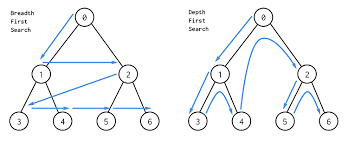

# [Silver III] 바이러스 - 2606 

[문제 링크](https://www.acmicpc.net/problem/2606) 

### 성능 요약

메모리: 2152 KB, 시간: 0 ms

### 분류

그래프 이론, 그래프 탐색, 너비 우선 탐색, 깊이 우선 탐색

### 제출 일자

2024년 8월 30일 18:45:52

### 문제 설명

<p>신종 바이러스인 웜 바이러스는 네트워크를 통해 전파된다. 한 컴퓨터가 웜 바이러스에 걸리면 그 컴퓨터와 네트워크 상에서 연결되어 있는 모든 컴퓨터는 웜 바이러스에 걸리게 된다.</p>

<p>예를 들어 7대의 컴퓨터가 <그림 1>과 같이 네트워크 상에서 연결되어 있다고 하자. 1번 컴퓨터가 웜 바이러스에 걸리면 웜 바이러스는 2번과 5번 컴퓨터를 거쳐 3번과 6번 컴퓨터까지 전파되어 2, 3, 5, 6 네 대의 컴퓨터는 웜 바이러스에 걸리게 된다. 하지만 4번과 7번 컴퓨터는 1번 컴퓨터와 네트워크상에서 연결되어 있지 않기 때문에 영향을 받지 않는다.</p>

<p></p>

<p>어느 날 1번 컴퓨터가 웜 바이러스에 걸렸다. 컴퓨터의 수와 네트워크 상에서 서로 연결되어 있는 정보가 주어질 때, 1번 컴퓨터를 통해 웜 바이러스에 걸리게 되는 컴퓨터의 수를 출력하는 프로그램을 작성하시오.</p>

### 입력 

 <p>첫째 줄에는 컴퓨터의 수가 주어진다. 컴퓨터의 수는 100 이하인 양의 정수이고 각 컴퓨터에는 1번 부터 차례대로 번호가 매겨진다. 둘째 줄에는 네트워크 상에서 직접 연결되어 있는 컴퓨터 쌍의 수가 주어진다. 이어서 그 수만큼 한 줄에 한 쌍씩 네트워크 상에서 직접 연결되어 있는 컴퓨터의 번호 쌍이 주어진다.</p>

### 출력 

 <p>1번 컴퓨터가 웜 바이러스에 걸렸을 때, 1번 컴퓨터를 통해 웜 바이러스에 걸리게 되는 컴퓨터의 수를 첫째 줄에 출력한다.</p>

### 제출 코드
```cpp
#define _CRT_SECURE_NO_WARNINGS
#include <iostream>
#include <algorithm>
using namespace std;
int N, M;

void findAccessNode(bool** pptrN, bool* ptrVisited, int start) {
	//visited count up 
	ptrVisited[start] = true;
	//start 노드의 적혀있는 간선으로 노드 방문
	for (int i = 1; i < N+1; i++)
	{
		if (!ptrVisited[i] && pptrN[start][i])
			findAccessNode(pptrN, ptrVisited, i);
	}
	return;
}

int main() {
	freopen("input.txt", "r", stdin);
	ios_base::sync_with_stdio(false);
	cin.tie(0);

	cin >> N >> M;

	bool** pptrN = new bool*[N+1];
	for (int i = 0; i < N + 1; i++) {
		pptrN[i] = new bool[N + 1](); // 모든 값을 false로 초기화
	}

	for (int i = 0; i < M; i++)
	{
		int n1,n2;
		cin >> n1 >> n2;

		pptrN[n1][n2] = true;
		pptrN[n2][n1] = true;
	}

	bool* ptrVisited = new bool[N + 1]();
	//recursive
	findAccessNode(pptrN, ptrVisited, 1);

	cout << count(ptrVisited, ptrVisited + N + 1, true) - 1;

	return 0;
}
```

### 풀이 과정
그래프 문제는 처음 풀어보았고, 그래프 이론이 약했다. 다만 visited를 중심으로 재귀함수를 구성하면 풀이가 가능해 보였고, 노드마다 배열을 동적으로 생성해주고 연결된 간선들을 각각의 노드의 배열에 입력해주었다.

이제 각 노드의 배열에서 연결된 노드들로 방문하는 함수를 구현하면 되겠다.

이때, 이미 방문한 노드는 제외해야하니 if에 추가해주고 연결된 모든 간선의 노드로 방문하게끔 for문으로 구성해주어 연결된 간선의 노드를 모두 방문하게 구현하여 해결하였다.

### 공부할 거리
그래프에도 깊이와 너비 우선탐색이 있다.
DFS와 BFS 방식인데, 내가 구현한 코드는 알아보니 재귀함수를 이용한 DFS방식의 구현 방식이 되겠다.

보통 DFS는 스택또는 재귀함수로 구현을 하며 BFS는 큐를 사용하게 된다.

해당 문제는 간선의 가중치도 없는 단순한 연결만 되어있는 그래프기 때문에 사실상 BFS가 더 적합한 문제라고 할 수 있겠다.



### BFS로 구현한 코드
```cpp
#define _CRT_SECURE_NO_WARNINGS
#include <iostream>
#include <algorithm>
#include <queue>

using namespace std;
int N, M;

void bfs(bool** pptrN, bool* ptrVisited, int start, int &count) {
	queue<int> q;
	q.push(start);
	ptrVisited[start] = true;
	count = 0;

	while (!q.empty()) {
		int current = q.front();
		q.pop();
		count++; //현재 노드 방문

		for (int i = 1; i < N+1; i++)
		{
			if (!ptrVisited[i] && pptrN[current][i])
			{
				q.push(i);
				ptrVisited[i] = true;
			}
		}
	}
}

int main() {
	freopen("input.txt", "r", stdin);
	ios_base::sync_with_stdio(false);
	cin.tie(0);

	cin >> N >> M;

	bool** pptrN = new bool*[N+1];
	for (int i = 0; i < N + 1; i++) {
		pptrN[i] = new bool[N + 1](); // 모든 값을 false로 초기화
	}

	for (int i = 0; i < M; i++)
	{
		int n1,n2;
		cin >> n1 >> n2;

		pptrN[n1][n2] = true;
		pptrN[n2][n1] = true;
	}

	bool* ptrVisited = new bool[N + 1]();
	//recursive
	int count;
	bfs(pptrN, ptrVisited, 1, count);

	//cout << count(ptrVisited, ptrVisited + N + 1, true) - 1;
	cout << count - 1;

	return 0;
}
```