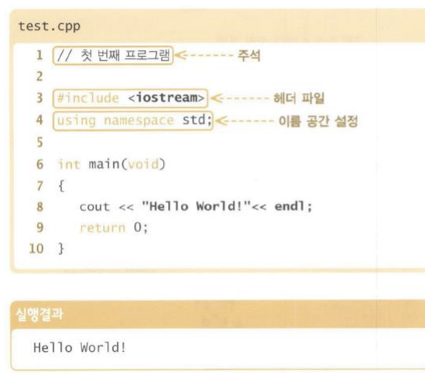

### c++
- c언어에 클래스 개념을 추가
- ANSI ISO에 의해 공동 개발

### 여러가지의 프로그래밍 스타일을 지원
- 절차 지향 : 순차적인 알고리즘 사용
- 객체 지향 : 데이터와 알고리즘을 합친 객체 사용
- 템플릿을 이용하는 일반화 프로그래밍 : 하나의 코드로 여러가지 경우를 처리
- 데이터 추상화

- 복잡한 프로그래밍 환경없이도 실행되어야 함

### 객체지향
객체
- 고유한 기능을 수행
객체 지향의 개념
- 캡슐화 : 정보 은닉
- 상속
- 다형성
목표
- 코드의 재사용



#include <iostream>
- 헤더파일 : 컴파일러에게 필요한 정보를 가지고 있는 파일
- iostream 표준 입출력 스트림
    - 이는 키보드로부터 입력을 받고, 콘솔에 출력하는 등의 입출력 작업을 간편하게 처리할 수 있도록 도와준다.
    - cin : 표준 입력 스트림, 입력받음
    - cerr : 표준 오류 출력 스트림, cout과 달리 버퍼링 하지 않는다.
    - <<는 출력, >>는 입력에 사용됨

```
#include <iostream>

int main() {
    int number;
    std::cout << "Enter a number: ";
    std::cin >> number;
    std::cout << "You entered: " << number << std::endl;
    return 0;
}
```

주의
- 전처리기 지시자 문장에는 세미콜론을 붙이지 X
- 헤더 파일 이름에 .h 를 붙이지 않는다. (c헤더에는 붙임)

-> 전처리기 지시자란, C++ 소스 코드를 컴파일하기 전에 처리되는 특별한 명령. 코드를 수정하거나 컴파일러에게 특정 동작을 지시할 때 사용
```
#include: 다른 파일의 내용을 현재 파일에 넣는 명령
#define: 매크로를 정의하는 명령. 코드를 더 간단하게 만들거나 가독성을 높이는 데 사용됨
#ifdef, #ifndef, #endif: 조건부 컴파일을 지시하는 명령. 특정 조건이 참일 때만 코드 블록을 컴파일하도록 하는 데 사용.
#if, #elif, #else: 조건부 컴파일을 지시하는 명령. 여러 가지 조건을 사용하여 코드 블록을 컴파일하거나 건너뛸 수 있다.
#pragma: 컴파일러에게 특정 동작을 지시하는 명령. 컴파일러마다 지원하는 pragma 지시자가 다를 수 있다.
#undef: 이전에 정의된 매크로를 해제하는 명령.
```

using namespace std
- C++에서 표준 라이브러리인 std 네임스페이스에 있는 모든 식별자를 현재의 네임스페이스에 가져오는 명령
- cout을 사용할 때 std::cout 대신에 cout만 사용 가능하나, 큰 프로젝트에서는 충돌 발생 가능

endl
- 화면의 줄을 바꾸는 제어문자 \n

__출처__  
명품 C++ Programming  
© Chang Seung Kim – All rights reserved 