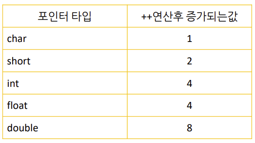

## 배열
배열(array)
인덱스(index)

__배열의 선언__  
int array[10];
- 자료형,배열명,배열크기

__배열의 초기화__
- 초기값이 부족한 경우
    - 초기값이 일부만 주어질때, 나머지 원소는 0으로 초기화 된다.
    - int array[5] = {10,20,30}
    - array <- {10,20,30,0,0}
- 배열의 크기가 주어지지 않으면 초기값의 개수만큼 생성된다.
    - int array[] = {10,20,30}

__동적 배열__
- c++에는 더 강력한 배열이 존재
- 실행 시간에 따라 크기를 변경할 수 있는 배열 : 벡터(Vector)
- STL 라이브러리로 제공

__다차원 배열__
```cpp
#include <iostream>
using namespace std;
const int ROWS=3;
const int COLS=3;

int main() {
    int A[ROWS][COLS] = { { 2,3,0 }, { 8,9,1 }, { 7,0,5 } };
    int B[ROWS][COLS] = { { 1,0,0 }, { 1,0,0 }, { 1,0,0 } };
    int C[ROWS][COLS];
    int r,c;
    
    for(r = 0;r < ROWS; r++)
        for(c = 0;c < COLS; c++)
            C[r][c] = A[r][c] + B[r][c];
    
    for(r = 0;r < ROWS; r++) {
        for(c = 0;c < COLS; c++)
            cout << C[r][c] << " ";
        cout << endl;
    }
    return 0;
}
```
```cpp
A 배열:
| 2 3 0 |
| 8 9 1 |
| 7 0 5 |

B 배열:
| 1 0 0 |
| 1 0 0 |
| 1 0 0 |

C 배열 (A + B):
| 3 3 0 |
| 9 9 1 |
| 8 0 5 |
```

## 포인터(Pointer)
- 주소를 가지고 있는 변수
```
int i = 10; // 정수형 변수 i 선언
int *p = &i; // 변수 i의 주소가 포인터 p로 대입
```

__간접 참조 연산자__
- 포인터가 가리키는 곳의 값을 나타내는 연산자
- 포인터 변수 앞에 붙여 사용
```cpp
int i = 10;
int* p = &i; // int* p; p = &i;
cout << *p; // 10이 출력된다.
*p = 20;
cout << *p; // 20이 출력된다
```

__포인터 연산__ 😃  

연산 예
```cpp
#include <iostream>
using namespace std;

int main() {
	char* pc;
	int* pi;
	double* pd;

	pc = (char*)10000;
	pi = (int*)10000;
	pd = (double*)10000;
	cout << "증가 전 pc = " << (void*)pc << pi << pd << endl;

	pc++;
	pi++;
	pd++;
	cout << "증가 후 pc = " << (void*)pc << pi << pd << endl;
}
```
```cpp
증가 전 pc = 0000000000002710 0000000000002710 0000000000002710
증가 후 pc = 0000000000002711 0000000000002714 0000000000002718
```
배열과 포인터
```cpp
#include <iostream>
using namespace std;

int main() {
	const int STUDENTS = 5;
	int grade[STUDENTS] = {10, 20, 30, 40, 50};

	//grade는 배열의 첫번째 요소를 가리키는 포인터
	//student는 요소수이므로 pend는 배열의 끝을 가리키는 포인터
	for (int* p = grade, *pend = grade + STUDENTS; p != pend; p++)
		cout << *p << " ";
	return 0;
}
```

__배열을 함수로 전달할때__  
배열 자체를 복사하는 것이 아닌 주소만 전달함

### const와 포인터

__const 객체에 대한 포인터__
```cpp
const double* p; // double 상수를 가리키는 포인터
double d = 1.23;
p = &d; // 가능!
*p = 3.14; // 컴파일 오류!
```
포인터 변수를 통한 실제 변수의 값을 변경할 수 없다.

__객체를 가리키는 const 포인터__
```cpp
double* const p = &d; // double을 가리키는 포인터 상수
double d = 1.23; 
*p = 3.14; //가능!
p = p + 1; //컴파일 오류, p는 변경될 수 없다
```
포인터가 상수이므로, 포인터가 가리키는 변수는 변경가능, 그러나 포인터의 값은 변경할 수 없다.

const int* p1;
- const int에 대한 포인터
- *p1 = 100; (X) 상수 변수는 바꿀 수 없다.

int* const p2;
- int를 가리키는 p2 포인터가 상수
- p2 = p1; (X) p2 포인터는 상수이므로 변경될 수 없다.

c++에서는 묵시적인 포인터 변환을 허용하지 않는다.
```cpp
int* pi;
double* pd;
void* vp;

vp = pi;
pd = vp;
```
`error>> void* 에서 double* 로 변환할 수 없습니다.`

__출처__  
명품 C++ Programming  
자료 출처: © Chang Seung Kim