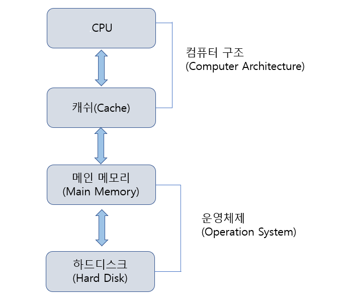
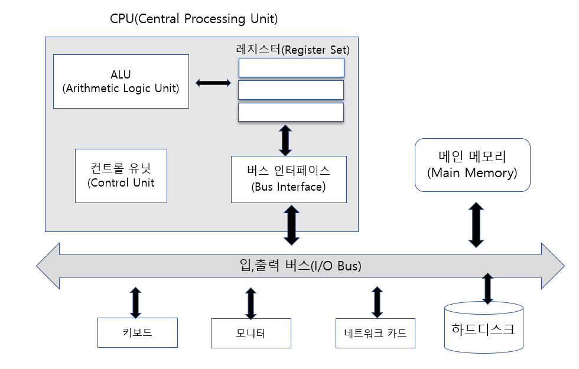
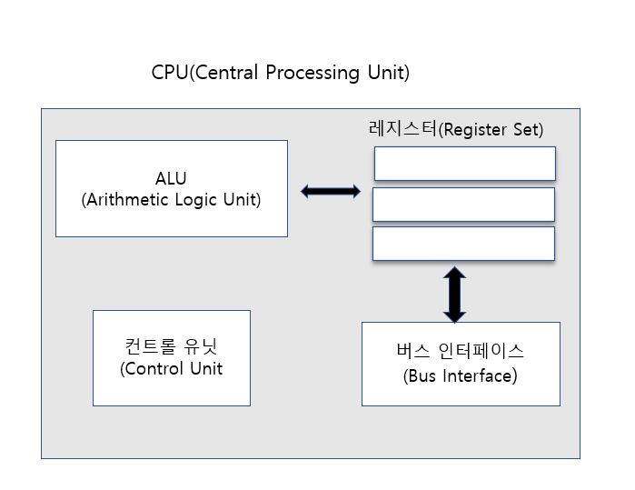
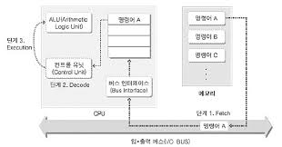
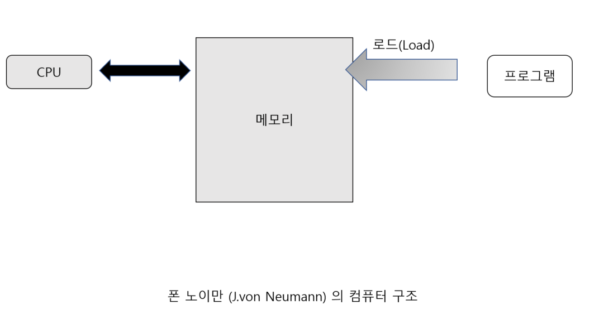
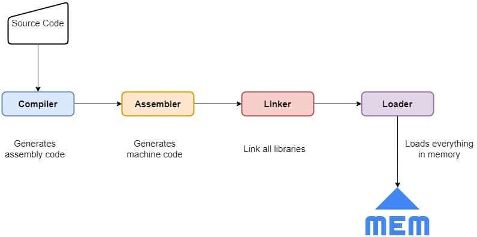
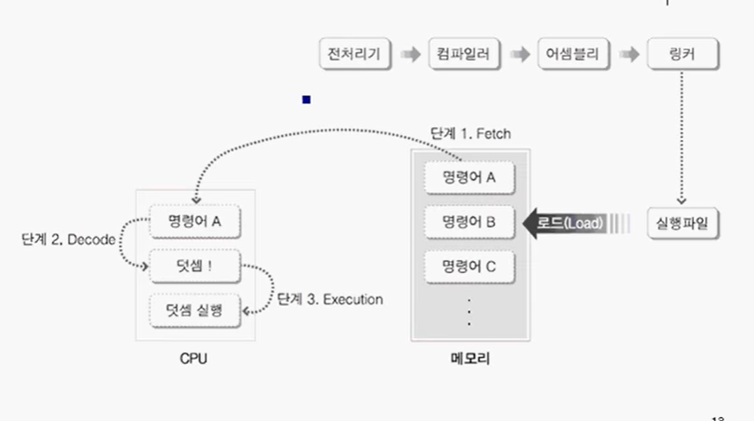
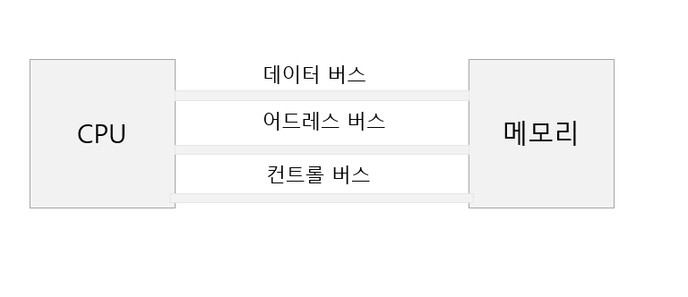

# 1장 시스템 프로그래밍의 이해와 접근
## 시스템 프로그래밍의 이해와 접근
### 시스템 프로그래밍이란 (System Programming)?
"컴퓨터 시스템을 동작시키는 프로그램"

즉, 컴퓨터를 동작시키기위해 필요한 프로그램을 의미

* 하드웨어를 직접 컨트롤하는 개발자들을 시스템 프로그래머라 부른다.

하지만, 컴퓨터 시스템이 하드웨어만을 뜻하는것이 아니다. 하드웨어가 실질적인 동작을 할 수 있게 도와주는 운영체제를 포함하는 것이 보통이다. 

__컴퓨터 시스템 = 하드웨어 + 운영체제__

이러한 시스템 프로그래밍은 모든 개발자가 꼭 알아야하는 내용이다.

윈도우에서 제공하는 시스템 함수를 이해하려면 운영체제에 대한 지식이, 운영체제를 이해하기 위해 컴퓨터 구조에 대한 지식이 필요하다. 하드웨어는 그 중 컴퓨터 구조의 기본적인 이해이다.

### 컴퓨터 시스템의 주요 구성요소

대학에서는 CPU와 캐쉬를 컴퓨터 구조 과목에서 다루고,
메인 메모리와 하드디스크에 대한 내용을 운영체제에서 다루는것이 보통이다.

컴퓨터 구조와 운영체제를 바탕으로 시스템 프로그래밍뿐만이 아니라 언어의 문법적 요소만을 이해한 개발자보다 효율적인 프로그램을 구현하는 것이 가능하다.

## 컴퓨터 하드웨어의 구성

### CPU (Central Processing Unit)
### 메인 메모리 (Main memory)
컴파일이 완료된 프로그램 코드가 올라가서 실행되는 영역
### 입.출력 버스 (Input/Output Bus)
컴퓨터의 구성요소 사이사이에서 데이터를 주고 받기 위해 사용되는 경로이다. 종류와 역할에 따라 아래로 분류된다.
- 어드레스 버스
- 데이터 버스
- 컨트롤 버스

## CPU에 대한 이해

### ALU (Arithmetic Logic Unit)
덧셈 뺄셈같은 산술 연산과 AND같은 논리 연산을 수행

### 컨트롤 유닛 (Control Unit)
실행파일엔 CPU에게 일을 시키기 위한 명령어가 저장되어 있다. 어떤 경로든 이 명령어가 CPU 내부로 흘러 들어가야 한다. 하지만 이 명령어을 그대로 ALU가 받으면 이해하지 못한다..

ALU는 더욱 단순하기에 컴퓨터의 명령어를 해석하기위해 ALU만의 비서가 필요하다 그와 같은 기능을 담당한다.
컨트롤 유닛은 명령어를 해석하고 그 해석된 결과를 CPU의 다른 블록에 보내는 역할을 한다.

### CPU 내부에 존재하는 레지스터들 (Register Set)
CPU 내부에 존재하는 아주 작은 메모리
ALU와 컨트롤 유닛이 바쁜상황에서, 컨트롤 유닛이나 ALU가 필요로 하는 명령어 및 데이터들을 어디엔가 저장해 두고 상황이 허락될 때 직접 가져가도록 하면 좋을것이다. 이때 조그마한 메모리 공간이 필요하게 된다.

이를 레지스터라고 하며 2진 데이터를 저장하는 저장장치이다. 나중에 파이프라인을 학습하면 이해하기 쉬울것이다.

### 버스 인터페이스 (Bus Interface)

앞선 과정에서 데이터들이 CPU내부에 어떻게 들어갔겠는가? 이는 버스 인터페이스가 있기 때문이다.
컴퓨터 구성요소들은 서로 데이터들을 실시간으로 주고 받으면서 동작한다. 

이때 데이터를 주고 받을땐 버스라는 단순한 통로가 있다고 되는 것이 아니다. 일종의 통신의 개념으로써 I/O 버스의 통신 방식을 이해하여 버스를 이용하게 해주는 무엇인가가 필요하다. 그것이 버스 인터페이스이다.

마치 항구처럼 프로토콜과 통신 방식을 이해하고 선착장에서 물건(데이터)를 받기도 싣기도 하며 역할을 수행한다.

### 클럭 신호 (Clock Pulse)
CPU 클럭의 속도가 높아지면 컴퓨터의 성능도 좋아진다고 알고있다. 그때의 클럭이다.
클럭 신호는 타이밍을 제공하기 위해서 필요하다. 이 신호에 맞춰서 CPU가 일을 한다.

CPU는 왜 클럭신호에 맞춰서 일을 해야하는가?

예를 들어 여러 장치를 합친 간단한 장비가 있을때, 각 장치가 데이터를 처리하고 가져오는 속도가 동기화 되지 않으면, 어떤 다음의 장치에서 유실될 수가 있을 것이다. (극단적인 예)

이 문제를 해결하기 위해선 가장 느린 장치의 장단에 동기화 시켜주면 되는 것이다. 비슷하게 컴퓨터 시스템에도 이러한 이유로 클럭 신호를 필요로 한다.

## 프로그램의 실행 과정

###  위대한 수학자 폰 노이만

폰노이만은 최초로 프로그램이 컴퓨터 내부에 저장되는 구조를 생각해냈다. 이는 오늘날의 컴퓨터에 대한 개념이다.
    
### 프로그램의 실행 과정

1. 전처리기에서 소스코드를 적절히 변경
2. 컴파일러에 의해 어셈블리로 번역
3. 어셈블리어에 의한 바이너리 코드 생성
### 4. 링커에 의한 연결과 결합

프로그램 내에서 참조하는 함수나 라이브러리들을 하나로 묶는 작업
링커로 생성된 실행파일은 컴퓨터에게 일을 시키기 위한 명령어가 들어 있다. 이것이 메모리 공간에 올라간 이후 실행되기 시작한다.
그 이후 3단계의 과정을 거쳐 실행된다.

1. Fetch : 메모리 상에 존재하는 명령어를 cpu로 가져오는 작업
2. Decode : 가져다 놓은 명령어를 cpu가 해석
3. Excution : 해석된 명령어의 명령대로 cpu가 실행하는 단계
    
## 하드웨어의 구성의 재접근
### 폰노이만의 컴퓨터 구조와 오늘날의 컴퓨터 시스템
Execution의 주체는 ALU
Decode는 명령의 해석 = 컨트롤 유닛
명령어를 cpu로 이동시키는데 이때 저장되는 곳이 레지스터 (IR)

### 데이터의 이동의 기반이 되는 버스 시스템

- 데이터 버스 : 데이터는 말그대로 연산자와 피연산자, 명령어 등이 되겠다. 그들을 이동하기 위한 버스이다.
- 어드레스 버스 : 주솟값을 이동시키기 위한 버스로 CPU가 0x1024 번지의 데이터 4바이트를 읽고 싶다면 메모리 영역에 그 주소를 전달해야 한다. 이럴때 쓰이게 된다.
- 컨트롤 버스 : 특별하게 cpu와 메모리가 사인을 주고 받는 영역이다.

### 이미지 출처
https://github.com/connieya/system_programming