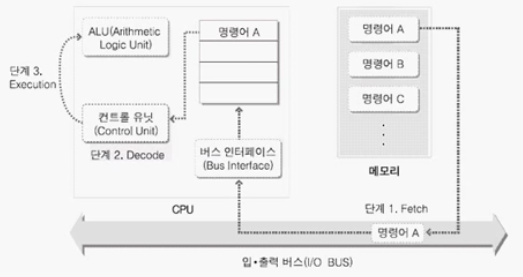

### 64비트와 32비트

"한번에 전송 및 수신할 수 있는 데이터의 크기와 한 번에 처리할 수 있는 데이터 크기를 기준으로  32비트/64비트 시스템이 나뉘어진다."

### 프로그래머 입장에서의 64비트 컴퓨터
32비트에서 64비트로 넘어왔을때
- 프로그램으로 표현할 수 있는 범위의 증가
- 표현할 수 있는 메모리의 전체 크기
- 주솟값을 표현하는 포인터의 크기가 증가
- 2^64개의 표현 가능

보통의 경우
64bit -> 64ptr
32bit -> 32ptr
포인터는 위 사이즈를 가진다. 왜 일까?

자 다시 읽어보자 "한번에 전송 및 수신할 수 있는 데이터의 크기와 한 번에 처리할 수 있는 데이터 크기를 기준으로  32비트/64비트 시스템이 나뉘어진다."

"포인터 크기는 크면 클수록 좋다."
다만, I/O버스에서 송수신이 가능한 최대 크기만큼 크도록 제한을 해야한다. 그 이상으로 커버리면 데이터를 쪼개서 송수신하기때문에 성능이 저하된다.

32비트 기준 I/O 버스에서 최대 32비트로 데이터가 전송된다. 어드레스 주소도 마찬가지이다.

그렇다는건 어드레스 주소의 크기도 32비트로 맞춰야 최대 효율일 것이다.

32비트에선 4바이트 포인터
64비트에선 8바이트 포인터를 사용

32비트 시스템에서는 2^32 = 총 4GB의 메모리에 접근이 가능하다. 그 말은 4GB 그 이상의 메모리에 접근하기 위해서 64비트 시스템이 필요해졌다는 의미이다.

## 64비트 기반 프로그래밍
### LLP64 vs LP64
LLP64 (Win)
LP64 (Unix)

### 64비트와 32비트 공존의 문제점
```cpp
#include <stdio.h>
int main() {
	int arr[10] = {0,};
	int arrVal = (int)arr; //데이터 손실 발생 가능성
	printf("pointer : %d \n", arrVal);
	return 0;
}
```
데이터 손실의 문제, 64비트 시스템에서 포인터의 크기는 8바이트이므로 int로 형변환할 시 데이터 손실이 우려

### Polymorphic 자료형
```cpp
#if defined(_WIN64)
	typedef __int64 LONG_PTR;
	typedef unsigned __int64 ULONG_PTR;
	typedef __int64 INT_PTR;
	typedef unsigned __int64 UINT_PTR;
#else
	typedef long LONG_PTR;
	typedef unsigned long ULONG_PTR;
	typedef int INT_PTR;
	typedef unsigned int UINT_PTR;
#endif
```
PTR이라고 포인터 자료형이 아니다!
포인터에 관련된 자료형을 사용할때 이용하므로 PTR을 붙인 것이다.

### 오류의 확인
- GetLastError 함수와 에러코드
윈도우에서는 에러 발생시 전역적으로 선언된 메모리에 오류에 대한 데이터를 저장해놓는다. 이후 오류메세지 출력 시 해당 메모리에서 꺼내서 사용.

그때 사용되는 것이 __GetLastError 함수__
- 에러가 발생하면 바로 호출해야 함.

전역 메모리에 에러가 발생하지 않으면 발생하지 않은 내용도 저장된다. 때문에, 곧바로 호출해야 함.

MSDN에서 오류 번호에 대한 내용 확인 가능