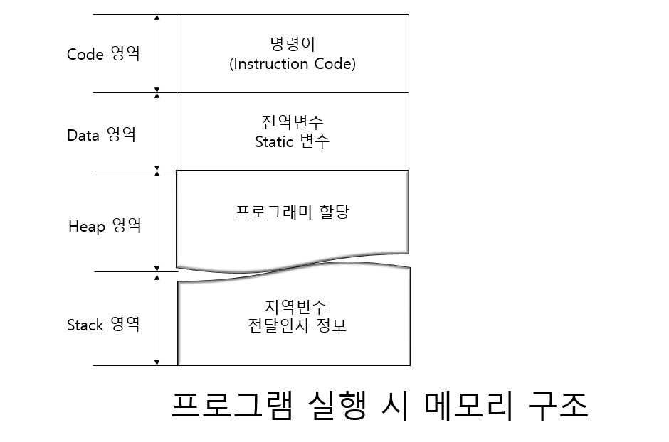
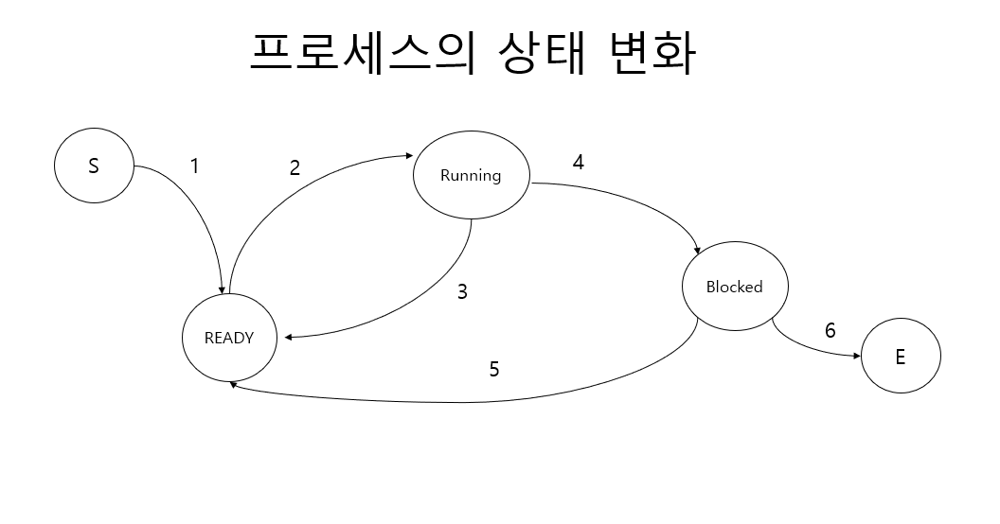
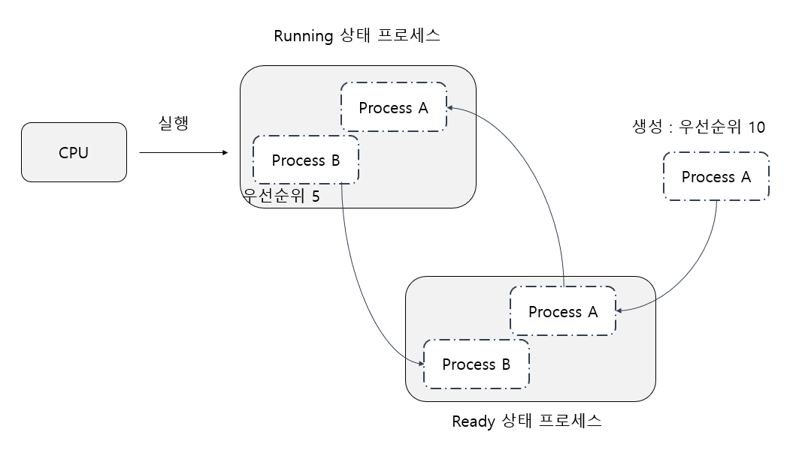
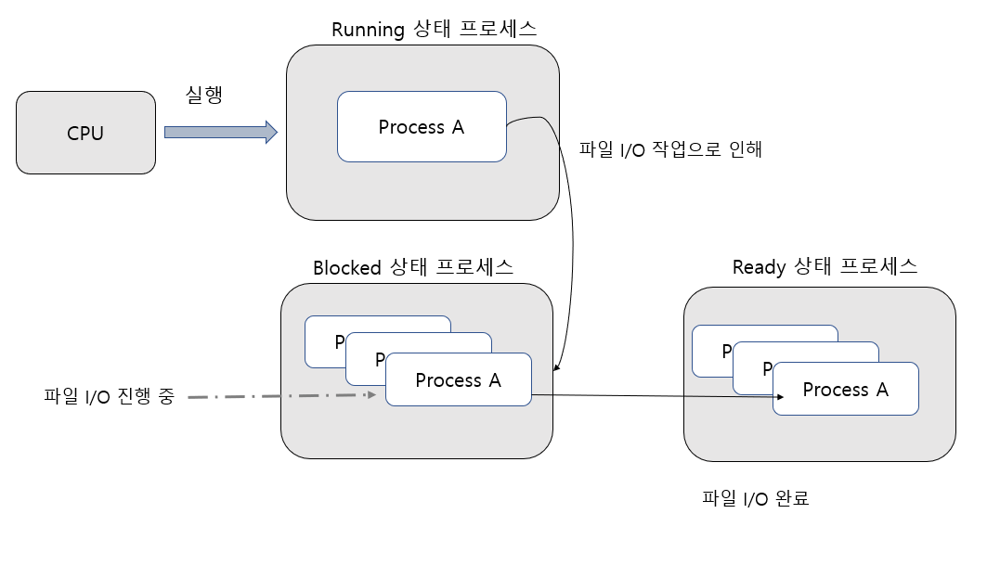
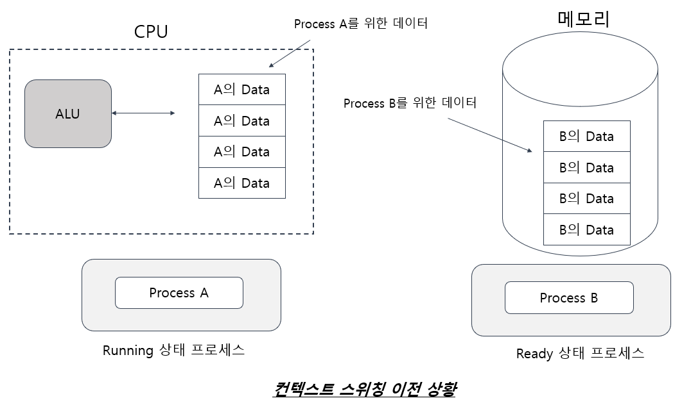
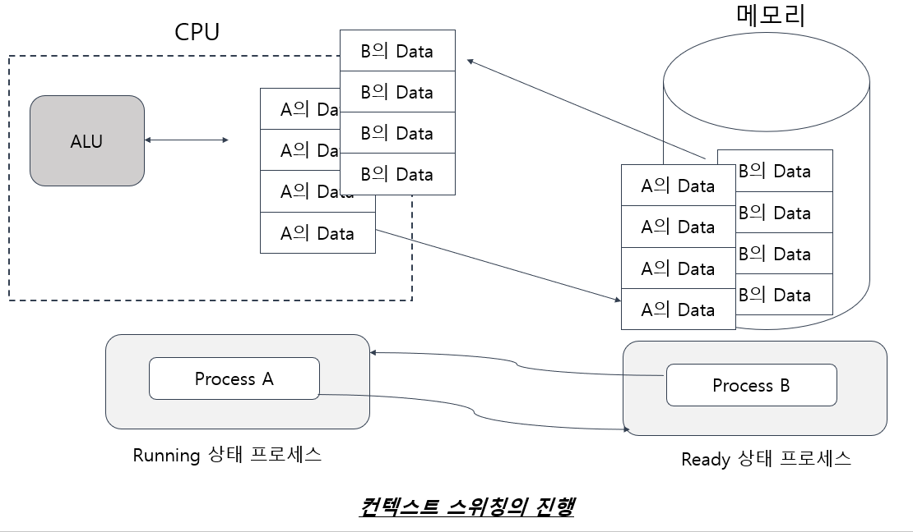

## 프로세스의 이해
### 프로세스란 무엇인가?
프로세스란 실행 중에 있는 프로그램을 의미한다.

예를 들어, 벽돌깨기 게임이 하드에 저장되어 있고, 이 실행 파일 이름을 block.exe라 한다면 
이를 프로그램이라 한다.

이제 이를 클릭하면, 메모리 할당이 일어나고, 메모리 공간으로 해당 파일의 바이너리 코드가 올라가게 된다. 이제부턴 이를 프로세스라 한다.

### 프로세스를 구성하는 요소
`Execution of "C" Program`

프로그램이 실행될 때 구성되는 메모리 공간

실행 파일 내에 존재하는 명령어들이 메모리상에 올라가서 순차적으로 실행된다. 이렇게 실행 파일을 구성하는 명령어들이 올라가는 메모리 영역을 Code영역이라 한다.

위와 같은 메모리 공간의 구성을 통틀어 실행 중인 프로세스의 실체라 할 수 있다.
그리고 실행되고 있는 프로세스 개수 만큼 생성된다.

`Resister Set`

프로세스의 구성하는 요소로 더불어 생각해야할 것은 cpu내의 레지스터이다. 프로그램의 실행을 위해 레지스터는 필수불가결하다.

어떤 프로그램을 실행 중이라면 cpu를 구성하는 레지스터들은 해당 실행을 위한 필요한 데이터들로 채워지게 된다. 따라서 레지스터들의 상태까지도 프로세스의 일부로 포함시킬 수 있다.

* 프로세스 = 구성되는 메모리 공간 + 프로그램의 데이터로 채워진 레지스터 셋

## 프로세스의 스케줄링과 상태 변화
### 프로세스의 스케줄링(Scheduling)
cpu는 하나인데 동시에 여러 프로세스가 실행된다. 

이는 cpu는 아주 빠르기 때문에 하나의 cpu가 여러 프로세스를 고속으로 번갈아 가며 실행 시킬 경우, 동시에 여러 개의 프로그램을 실행시킨다고 느껴지게 된다.

이때, 여러 개의 프로세스들이 cpu 할당 시간을 나누게 된다.

`스케줄링의 기본 원리`

여러개의 프로세스가 동시에 실행되어야 한다고 가정해보자. 어떠한 기준으로 cpu를 할당해주어야 할까?

이렇게 프로세스의 cpu할당 순서 및 방법을 결정짓는 일을 가리켜 스케줄링이라 한다. 이때 사용되는 알고리즘을 가리켜 스케줄링 알고리즘이라고 한다. 또한 이를 적용시켜 실제로 프로세스를 관리하는 운영체제 요소(모듈)을 가리켜 스케줄러라고 한다.

스케줄러는 어떤 하드한 장치가 아니라 일종의 소프트웨어로써, 운영체제를 구성하는 중요한 요소 중에 하나이다.

`멀티 프로세스는 cpu를 바쁘게 한다.`

우리가 실행해야 할 프로세스 a,b,c가 있다고 가정해보자. 이 프로세스 들이 실행되는 형태를 두가지로 볼 수 있다.

첫째로 고전적인 방식으로 a를 실행, a가 끝나면 b를 실행하는 식이다.

둘째로 멀티 프로세스 운영체제의 방식으로 a,b,c를 모두 실행시킨 후 스케줄러에 의해 관리되도록 하는 것이다.

일반적으로 프로그램이 실행되는 과정에서 많은 시간이 할당되는 경우는 언제일까? 보통 I/O일 것이다.

비단 파일이나 키보드 등의 입출력 말고도 네트워크 상에서의 송수신 과정도 I/O에 해당된다.

이러한 I/O과정에서, 즉 홈페이지에 접속하여 로딩하는 동안 컴퓨터의 모든 프로세스가 동작을 멈춘다면 시스템 자원적으로 얼마나 ㅛ낭비가 클까?

이러한 측면에서 고전적인 방식보단 멀티 프로세스 기반으로 프로세스를 처리하는 것이 훨씬 효율적일 것이다.

### 프로세스의 상태 변화

멀티 프로세스 운영체제에서 프로세스 각각의 상태는 시간흐름에 따라 변화한다.

`상황 1 : S(Start) 에서 Ready 상태로의 전이를 보여준다.`
S는 프로세스의 생성을 의미한다. 생성과 동시에 ready 상태로 돌입하며 언제든지 스케줄러에 의해 cpu로 실행되기를 기다리는 상태이다.

`상황 2 : Ready 상태에서 Running 상태로의 전이를 보여준다.`
ready 상태의 프로세스들은 스케줄러에 의해 관리 되는 프로세스들이다. 스케줄링 알고리즘에 기반하여 running 상태로 끌어와 실행되게 한다.

`상황 3 : Running 상태에서 Ready 상태로의 전이를 보여준다.`

프로세스는 우선순위의 개념이 존재한다. 즉 프로세스들은 생성 시 중요도에 따라 우선순위가 매겨진다. 예를 들어 A > B인 우선순위를 가진 프로세스가 있을때, B가 실행 중이다. 그런데 갑자기 A가 생성돼 ready 상태로 존재한다면 스케줄러는 A를 running으로 B는 ready로 다시 끌어 내릴 것이다. B는 다시 ready 상태에서 우선순위에 따라 선택되기를 기다리게 된다.

`상황4 : Running 상태에서 Blocked 상태로의 전이를 보여준다.`

실행 중인 프로세스가 Blocked 상태로 들어가는 것이다. 일반적으로 I/O 작업시 발생하는데, 이러한 작업이 진행중인 프로세스 Blocked로 내리고 ready 상태의 프로세스를 running으로 올리는 것이 cpu를 효율적으로 이용하는 방법이다. 

* I/O작업 중 blocked되었다고 가정했을 때, blocked된 상태에서는 스케줄러의 선택을 받지 못하며, 해당 작업이 끝난 후 ready 상태로 복귀하게 될 것이다.

`상황 5 : Blocked 상태에서 Ready 상태로의 전이를 보여준다.`
__blocked 상태는 스케줄러에 의해 선택될 수 없는 상태를 의미한다.__ ready 상태와 똑같이 현재 cpu에 실행되지는 않지만 분명한 차이점이 있는 것이다. 그러하므로 작업이 끝난 blocked 상태의 프로세스는 ready로 한번 더 넘어가 스케줄러의 선택을 기다리게 될 것이다.

- 스케줄러의 관심 대상 O -> Ready 프로세스
- " X -> Blocked 프로세스

## 컨텍스트 스위칭(Context Switching)
앞에서 멀티프로세스 운영체제의 기본 원리에 대해 알아보았다. 여러개의 프로세스들이 스케줄러에 의해 관리됨을 이해하고 프로그램 실행시간의 대부분을 I/O에 소모하기 때문에 둘 이상의 프로세스 실행은 cpu 활용도를 높여 성능 향상을 도모한다는 결론도 내리게 되었다.

하지만 그와 함께 다른 부하를 가져올 수도 있는데,,
"CPU 내에 존재하는 레지스터들은 현재 실행 중인 프로세스 관련 데이터들로 채워진다."

즉 이때, 우리는 한 가지 고민을 하지 않을 수 없다. 실행 중인 프로세스가 변경되면 CPU 내에 존재하는 레지스터들의 값이 변경되기 때문이다.

프로세스 A가 실행 중이다가 ready 상태로 들어간다. 이때 A는 아직 종료되지 않았으니 현재 상태의 레지스터 데이터들을 어디에다 백업? 저장해놔야한다. 이후 다시 running상태가 되었을때 다시 사용해야하니 말이다.

그 뿐이 아니다 지금 당장 B가 running 상태로 들어온다고 치면 어딘가에 백업되어있는 B의 레지스터 셋을 복원시켜 주어야한다. 그래야 멈췄었던 B의 작업이 오롯이 재진행될 수 있는 것이다.

위의 그림은 현재 A가 실행중인 상황이다. 그렇다보니 현재 레지스터에는 A의 데이터로 채워져있고 B는 ready 상태로 그의 레지스터 데이터는 메모리 어딘가에 저장(백업)되어 있다.

위 그림의 작업 과정을 가리켜 컨텍스트 스위칭(Context Switching)이라 한다. B의 작업이 이제 실행되기 위해 저장되어 있던 B의 관련 레지스터 데이터를 cpu의 레지스터에 복원시키고있다. 동시에 A의 레지스터 데이터는 저장되고 있다. (마치 스위칭하는 모습이다.)

여기서,

"실행 되는 프로세스의 변경과정에서 발생하는 컨텍스트 스위칭은 시스템에 많은 부담을 준다."

이는 레지스터가 많을수록 데이터 종류가 많을수록 더할 것이다. 이것이 멀티 프로세스 운영체제의 단점이라 말할 수 있다.

## 프로세스의 생성
### CreateProcess 함수의 이해

### 이미지 출처
https://github.com/connieya/system_programming