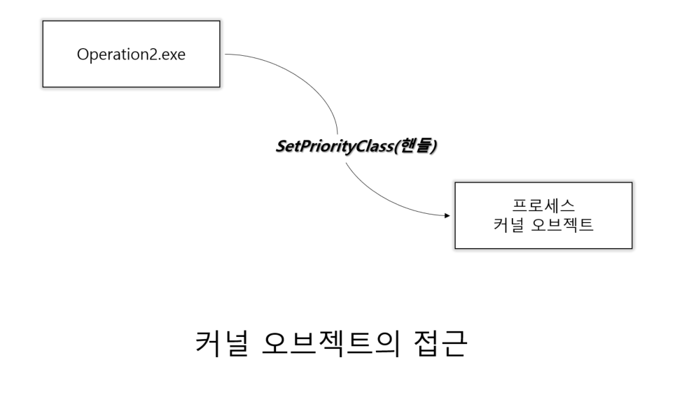
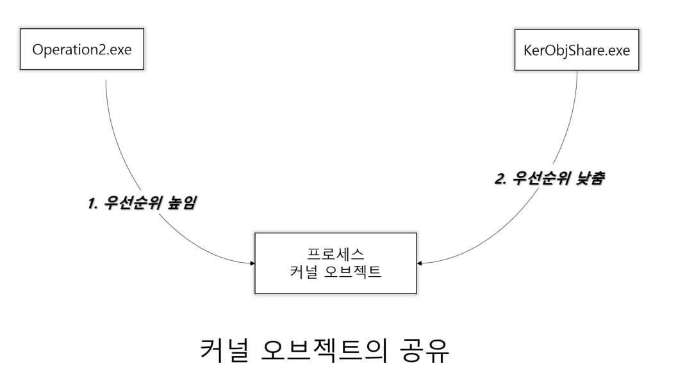
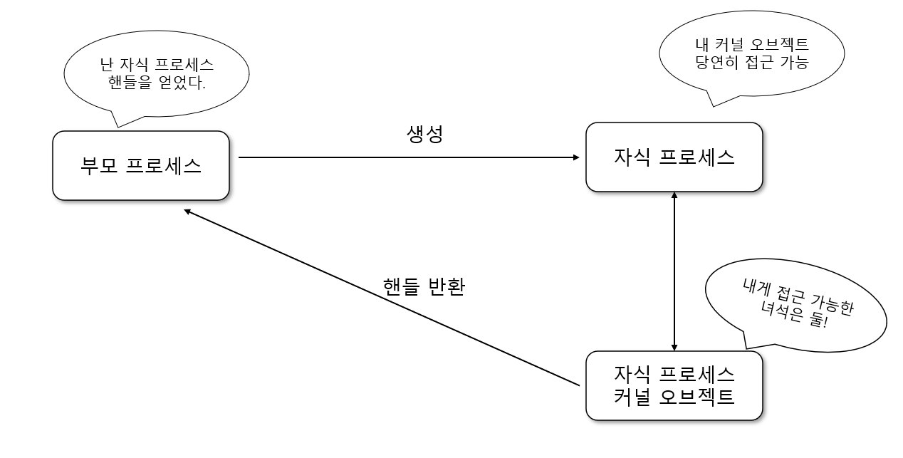
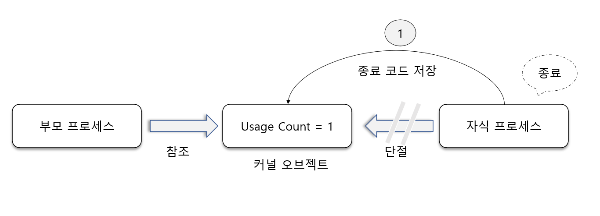
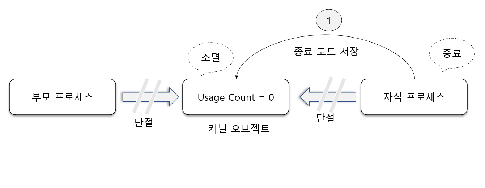

## 커널 오브젝트와 핸들의 종속 관계
### 커널 오브젝트의 종속 관계
"커널 오브젝트는 Windows 운영체제에 종속적이다."

- __커널 오브젝트는 프로세스에 종속적인 것이 아니라, 운영체제에 종속적인 관계로 커널 오브젝트의 소멸 시점은 운영체제에 의해서 결정된다.__

- 커널 오브젝트는 프로세스에 종속적인 것이 아니라 운영체제에 종속적인 관계로 여러 프로세스에 의해서 접근 가능하다. (물론, 함수 호출을 이용한 간접 호출임)

### 핸들의 종속 관계
그와 별개로
"핸들은 운영체제에 종속적이지 않고 프로세스에 종속적이다."

### 예제를 통한 종속 관계의 이해
커널 오브젝트가 여러 프로세스에 의해 접근 가능한 예시를 봐보자. 이 예제의 시나리오는 다음과 같다.

"A 프로세스가 B 프로세스를 생성한다. 그러자 B 프로세스는 자신의 우선순위를 높인다. 잠시 후 열받은 A 프로세스는 B 프로세스의 우선순위를 원래대로 돌려 놓는다."


위 그림에서 프로세스는 자신의 커널 오브젝트에 접근한다. GetCurrentProcess함수를 사용해 커널 오브젝트의 핸들을 반환받아 접근이 가능하다.



`구조체 변수 pi의 정체`
```cpp
typedef struct _PROCESS_INFORMATION {
//구조체: 프로세스와 스레드의 핸들과 ID를 포함합니다.

    HANDLE hProcess // 새로 생성된 프로세스의 핸들
    HANDTLE hThread // 새로 생성된 스레드의 핸들
    DWORD dwProcessId // 새로 생성된 프로세스의 ID
    DWORD dwThreadId // 새로 생성된 스레드의 ID
}
```
CREATE PROCESS를 통해 operation2 프로세스를 생성할때, pi 주솟값을 보내고 그때 operation2의 정보가 pi에 저장될 것이다.

pi.hProcess는 그렇게 생성된 프로세스의 핸들 정보로 채워지게 된다.

이후 SetPriorityClass 함수 호출을 통해 Operation2의 우선순위를 NORMAL_PRIORITY_CLASS로 변경하고 있다.

"프로세스 생성 시 얻은 프로세스의 핸들을 통해서 해당 자식 프로세스의 커널 오브젝트에 접근할 수 있다."

우리는 위 예제를 통해서 "커널 오브젝트는 프로세스에 종속적인 것이 아니라 운영체제에 종속적인 관계로 여러 프로세스에 의해서 접근이(공유가) 가능하다." 라고 언급한 내용을 확인한 셈이다.

*추가적으로 process_information 구조체에서
프로세스 핸들은 프로세스의 커널 오브젝트를 가리키기(구분짓기) 위한 것이고, 프로세스 ID는 커널 오브젝트가 아니라 프로세스 자체를 구분짓기 위한 것이다. 

이후에 핸들 테이블에 대해서 알게되면 자세히 이해할 수 있을 것이다.

## 커널 오브젝트와 Usage Count
### CloseHandle 함수에 대한 정확한 이해
A라는 이름의 프로세스가 생성되면, A 프로세스를 위한 커널 오브젝트가 생성된다. 이때 커널 오브젝트는 완전히 프로세스를 대표하게 된다.

그 역도 성립할까? 성립하지 않는다. 프로세스가 소멸된다고 해서 커널오브젝트가 소멸될 수도 있고 아닐 수도 있다. 운영체제가 결정할 일이다.

즉 다시말하지만, 커널 오브젝트는 운영체제에 종속적인 관계이다. 명심하자.

`CloseHandle 함수와 프로세스 소멸`
`KernelObjProb1.cpp`
```cpp
#include "stdio.h"
#include "tchar.h"
#include "windows.h"

int _tmain(int argc, TCHAR *argv[]) {
    STARTUPINFO si = {0,};
    PROCESS_INFORMATION pi;
    si.cb = sizeof(si);

    TCHAR command[] = _T("KernelObjProb2.exe");
    CreateProcess(
            NULL, command, NULL, NULL, TRUE,
            0, NULL, NULL, &si, &pi
    );
    CloseHandle(pi.hProcess);
    
    return 0;
}
```
CloseHandle(pi.hProcess); 은 함수의 반환을 의미한다. 즉 해당 커널오브젝트에 대해 핸들을 닫는 기능을 하고있다.

하지만 오해해서는 안되는 것이, "이 핸들이 가리키는 리소스가 더이상 필요없으니 이에 해당하는 리소스를 해제하고 커널 오브젝트를 소멸시켜라!" 라고 해석해서는 안된다!

위 프로그램을 실행시켜보면 자식 프로세스로 KernelObjProb2.exe를 실행한 후 CloseHandle을 수행하고 있다. 그렇다면 CloseHandle 수행시 KernelObjProb2.exe이 종료될까? 실제로는 그렇지 않다. 위 메인함수가 종료된 후 KernelObjProb2.exe는 계속 실행되는 상태이다. 왜 그럴까?

다시 이 함수의 의미를 해석해보자. "KernelObjProb2.exe 프로세스에 대해 더 이상 관여할 바 아니니, 해당 프로세스 핸들을 반환하라."

### CloseHandle 함수와 프로세스 종료 코드
프로세스 종료 시 커널 오브젝트도 소멸시키면 문제가 발생할 수 있다.

메인함수의 return값으로 0을 보통 전달해준다 왜 그럴까? exit도 -1를 전달시키든 어떤 숫자로든 종료시킬 뿐이다. 왜 인자값을 -1로 할까?

어떤 프로세스가 종료될때 return이든 exit든 커널오브젝트에 exit코드를 남기고 종료된다. 하지만 이때 커널 오브젝트도 종료된다면 프로세스가 남기고 떠난 exit코드가 필요할때 어떻게 가져올 수 있겠는가.
(일반적으로 비정상종료라면 -1 정상종료라면 0)

### 커널 오브젝트와 Usage Count
자식 프로세스의 종료 코드는 자식 프로세스의 커널 오브젝트에 저장된다. 자식 프로세스가 종료될 때 커널 오브젝트도 동시에 소멸된다면 부모 프로세스는 종료 코드를 얻을 수 없게 된다. 

그렇다면 언제 커널 오브젝트를 소멸시키는 것이 좋을 까? 해당 커널 오브젝트를 참조하는 대상이 하나도 없을 때 소멸시키는 것이 가장 이상적이다.

Windows 는 이러한 정책을 기반으로 커널 오브젝트 소멸 시기를 결정 짓기 위해 Usage Count(참조 횟수) 라는 것을 관리 한다. 이 Usage Count가 0이 되는 순간 해당 커널 오브젝트는 소멸된다.


프로세스는 생성과 동시에 커널 오브젝트의 Usage Count가 1이 된다. 만약 생성과 동시에 Usage Count 가 0으로 초기화 된다면, 커널 오브젝트 소멸 원칙에 의해 생성과 동시에 소멸되고 만다. 이를 막기 위해서 자식 프로세스는 생성과 동시에 Usage Count가 1이 된다.

이후 커널 오브젝트에 접근 가능한 대상이 늘어날때마다 US를 하나씩 증가시킨다.

그렇다면, 자식 프로세스의 US는 2가 되어야한다! 부모 프로세스도 자식 프로세스의 핸들을 얻기 때문이다. 실제로도 그러하다.

### Usage Count 와 CloseHandle

자식 프로세스가 종료되어 US 카운트가 하나 감소한다. US = 1인 관계로 커널 오브젝트는 아직, 종료되지 않는다.


이때 부모에서 CloseHandle을 반환하면 US가 하나 감소하고 값이 0인 관계로 이제서야 커널 오브젝트가 소멸된다.

### 출처
윤성우,  ⌜뇌를 자극하는 윈도우즈 시스템 프로그래밍⌟, 한빛미디어, 2006  
유튜브, "한빛미디어", "뇌를 자극하는 윈도우즈 시스템 프로그래밍", https://www.youtube.com/watch?v=GVX-m3RF-K0&list=PLVsNizTWUw7E2KrfnsyEjTqo-6uKiQoxc
Github, "system_programming", https://github.com/connieya/system_programming